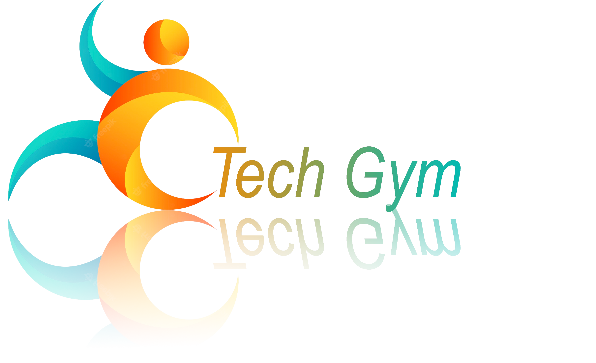
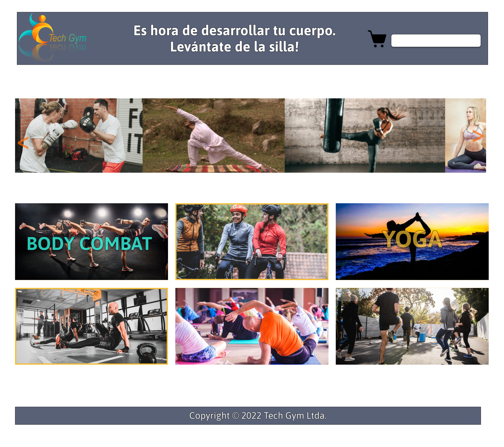
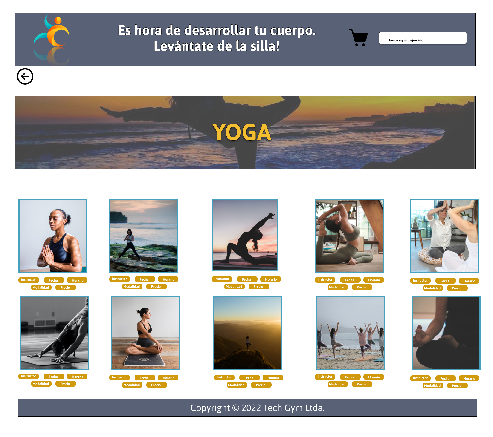
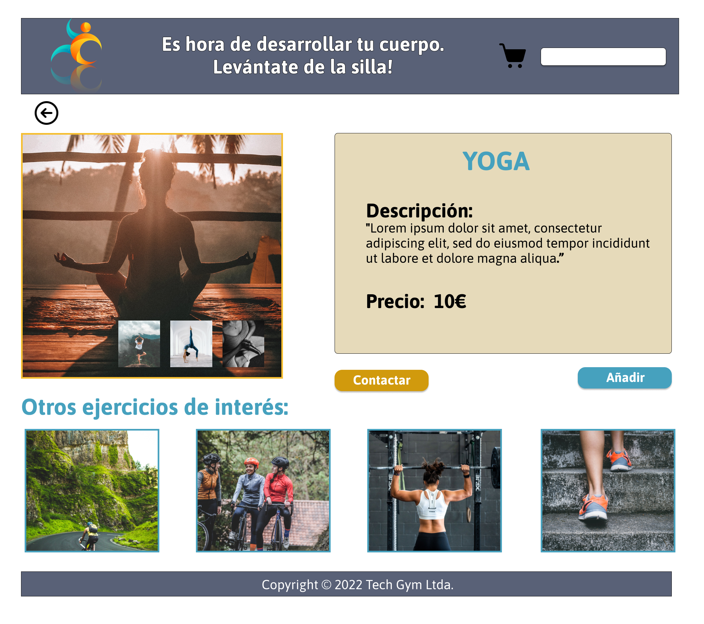
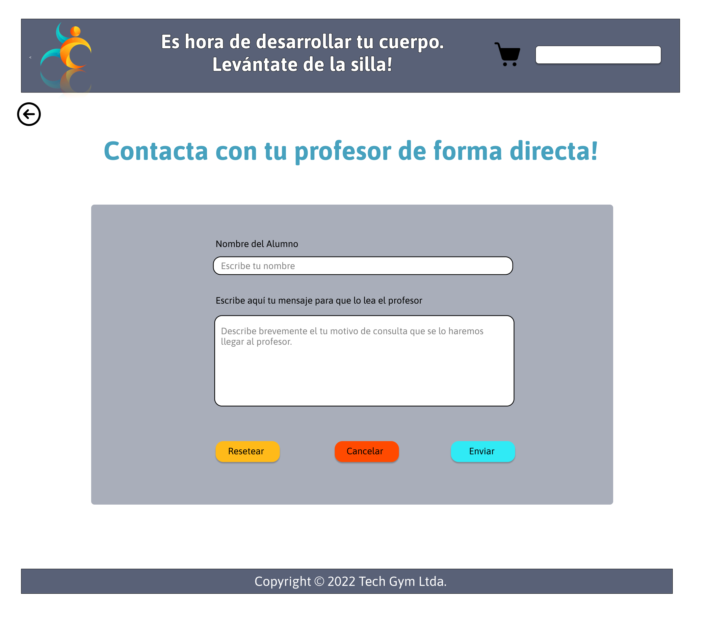

## Tabla de Contenidos:
1. [Logo](#tech-gym)
2. [Introducción](#introducción)
3. [Prototipo del proyecto](#prototipo-del-proyecto)
4. [Tecnologías utilizadas en el proyecto](#tecnologías-utilizadas-en-el-proyecto)
5. [Instalación](#instalación)
6. [Personas autoras](#personas-autoras)

## 💻 Tech Gym:

    
## 💠 Introducción:

Tech Gym es una plataforma para reservas de diferentes tipos de clases a precios asequibles con una variedad de modalidades, relacionadas al ámbito deportivo. Esta fue diseñada pensando en aquell@s coders que buscan posibilidades u opciones de agregar algún tipo de actividad física o mental en sus vidas, al alcance de un click.

## 🛠️ Prototipo del proyecto:
    

## ⚙️ Tecnologías utilizadas en el proyecto:

<ul>    
        <li>HTML</li>
        <li>React JS</li>
        <li>Styled Components</li>
        <li>Node Js</li>
        <li>Json Server</li>
        <li>Npm</li>
</ul>

## 🔍 Instalación:

     *** Tener instalado el Visual Studio Code y el Node js

    
<ul>
        <li>Clonamos el repositorio utilizamos el comando:</li>
            
git clone https://github.com/PazManrique/Tech-Gym.git

        <li>Instalamos Node Package Manager: </li>
            
npm install / npm i

        <li>Vizualizamos el proyecto ejecutando en un terminal integrado para:</li>
            
📂 El "server" usando el comando:

                
npx json-server db.json --port 1234

            
Y

            
📂 El "client" usando el comanod:

                
npm start

        <li>Para correr los test usamos el comando:</li>
            
npm run test

</ul>    

## ✒️ Personas autoras:

<ul>
        <li><a href="https://github.com/MBellJDD">Marybell José Díaz Díaz</a></li>
        <li><a href="https://github.com/Nereka38">Nerea Fernandez Cuesta</a></li>
        <li><a href="https://github.com/PMuin">Patricia Muiño Sánchez</a></li>
        <li><a href="">Alicia Gárgoles</a></li>
        <li><a href="https://github.com/PazManrique">Paz Manrique</a></li>
        <li><a href="https://github.com/jilbosch">Joan Gil Bosch</a></li>
        <li><a href="https://github.com/JcUrki">Jaciniris Bastardo</a></li>
</ul>
